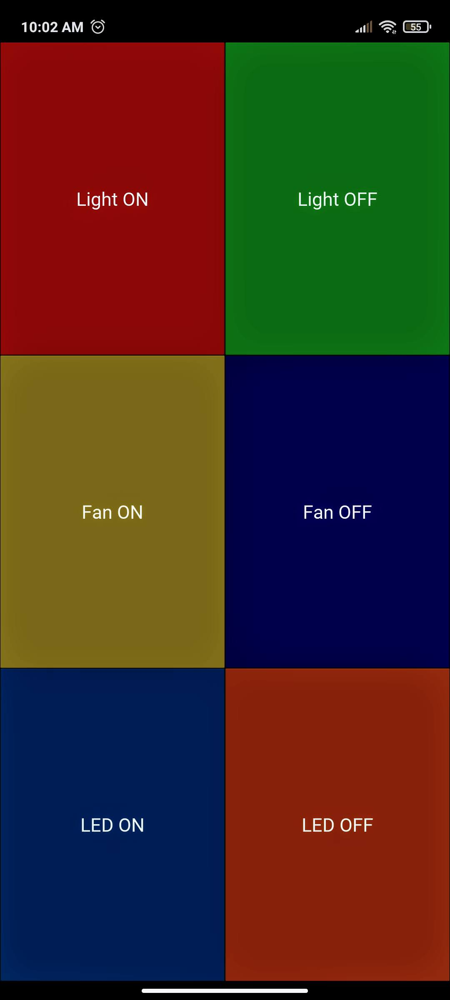

<!--
*** Thanks for checking out this README Template. If you have a suggestion that would
*** make this better, please fork the home-automation and create a pull request or simply open
*** an issue with the tag "enhancement".
*** Thanks again! Now go create something AMAZING! :D
***
***
***
*** To avoid retyping too much info. Do a search and replace for the following:
*** ParamDeshpande, home-automation, https://twitter.com/ParamDeshpande, deshpandeparam10@gmail.com
-->


<!-- PROJECT SHIELDS -->
<!--
*** I'm using markdown "reference style" links for readability.
*** Reference links are enclosed in brackets [ ] instead of parentheses ( ).
*** See the bottom of this document for the declaration of the reference variables
*** for contributors-url, forks-url, etc. This is an optional, concise syntax you may use.
*** https://www.markdownguide.org/basic-syntax/#reference-style-links
-->
[![Contributors][contributors-shield]][contributors-url]
[![Forks][forks-shield]][forks-url]
[![Stargazers][stars-shield]][stars-url]
[![Issues][issues-shield]][issues-url]
[![MIT License][license-shield]][license-url]
[![LinkedIn][linkedin-shield]][linkedin-url]


<!-- PROJECT LOGO -->
<br />
<p align="center">
  <a href="https://github.com/ParamDeshpande/home-automation">
    
  </a>

  <h3 align="center">Home Automation</h3>

  <p align="center">
    Toggling appliances with less effort
    <br />
    <a href="https://github.com/ParamDeshpande/home-automation"><strong>Explore the docs »</strong></a>
    <br />
    <br />
    <a href="https://github.com/ParamDeshpande/home-automation">View Demo</a>
    ·
    <a href="https://github.com/ParamDeshpande/home-automation/issues">home-automationrt Bug</a>
    ·
    <a href="https://github.com/ParamDeshpande/home-automation/issues">Request Feature</a>
  </p>
</p>


<!-- TABLE OF CONTENTS -->
## Table of Contents

* [About the Project](#about-the-project)
  * [Built With](#built-with)
* [Getting Started](#getting-started)
  * [Prerequisites](#prerequisites)
  * [Installation](#installation)
* [Usage](#usage)
* [Roadmap](#roadmap)
* [Contributing](#contributing)
* [License](#license)
* [Contact](#contact)
* [Acknowledgements](#acknowledgements)


<!-- ABOUT THE PROJECT -->
## About The Project

This is the 2nd version of my home automation project where appliances are simply toggled via an app, and the MCU serves as chat server and parses info . For the previous older version see [arduino-oldversion]([arduino-oldversion]),  where appliances were automatically toggled based on motion sensors ( however [cheap pir sensors]([[pir-sensor]]) are practically not so feasible ).

[![home-automation][product-screenshot]](https://github.com/ParamDeshpande/Home_Automation)


### Built With

* [Energia IDE](https://energia.nu/)
* [Kivy ( App dev )](https://kivy.org/#home)
* [TI CC3200](https://www.ti.com/product/CC3200)
* relays and a bunch of wires


<!-- GETTING STARTED -->
## Getting Started

The Ti's cc3200 is a overkill for this task, but I had it lying around hence I used it, the same stuff can be easliy achieved using any wifi supported board or ESP8266 and any arduino or bluepill or atmega ...etc. 

### Prerequisites

There's not much setup to do make sure you have the respective toolchain setup ( eg [Energia here](https://energia.nu/)). For the app dev make sure you have kivy setup and running preferably in a virtual env. 


### Installation

1. Clone the home-automation
```sh
git clone https://github.com/ParamDeshpande/home-automation.git
```
2. Install python requirements ( preferably in a venv )
```sh
cd isntallationDir/home-automation
pip3 install -r ti_IOT/requirements.txt
```

3. Find and install the app from [here](https://github.com/ParamDeshpande/home-automation/tree/master/ti_IOT/bin), on your android device. 
Make sure internet permissions are given to the app, ( it wont ask by itself ) else it will start stop and crash again and again.


<!-- USAGE EXAMPLES -->
## Usage

The GUI for mobile application is plain and simple and serves the basic tasks for which the project was intended for.
<p align="center">   

</p>

I'm not really an app developer, so spare me the unfancy GUI. 

while building new app from changes made in [main.py]() make sure to enable internet and set other parametrs like app icon and stuff in [buildozer.spec](https://github.com/ParamDeshpande/home-automation/blob/master/ti_IOT/buildozer.spec) file.

See [kivy installation docs](https://kivy.org/doc/stable/guide/packaging-android.html) for detailed steps to pack the application either google play or ios. 

To get the code on the toolchain compiling for the MCU, just change your SSID and password and flash it on your respective board. 

```
char ssid[] = "wifiname";
char password[] = "secret-or-not";
```

Since the board has 3 leds ( aint that nice ) , 
I made the red led denote offline or unconnected. 
Green LED connected to the wifi netowrk. 
Orange LED to blip away when parsing a message. 

You may change the sleep freqeuncy `sleep(1000);` from 1Hz to whatever you like, if you find the response slow enough. 

See the [ti_chat.ino in ti_IOT](https://github.com/ParamDeshpande/home-automation/tree/master/ti_IOT/ti_chat). I have tweaked this file from the official examples that were provided for the chat server. 


<!-- ROADMAP -->
## Roadmap

See the [open issues](https://github.com/ParamDeshpande/home-automation/issues) for a list of proposed features (and known issues).

Few enhacements or bug fixes I may / may not make might/coud be made are .. 

* Ping server before hand when the app opens and not when the button is pressed. 
* Add timeout mechanisms for both MCU server and in app.
* a connection notification in the app to tell if the mcu server received the msg, and other debug msgs.
* Integrating motion sensors. 
* Adding a widget for home screen instead of opening the app and permission and auto permisions and stuff.
* ...

<!-- CONTRIBUTING -->
## Contributing

Contributions are what make the open source community such an amazing place to be learn, inspire, and create. Any contributions you make are **greatly appreciated**.

1. Fork the Project
2. Create your Feature Branch (`git checkout -b feature/AmazingFeature`)
3. Commit your Changes (`git commit -m 'Add some AmazingFeature'`)
4. Push to the Branch (`git push origin feature/AmazingFeature`)
5. Open a Pull Request


<!-- LICENSE -->
## License

Distributed under the MIT License. See `LICENSE` for more information.


<!-- CONTACT -->
## Contact

Param Deshpande - [@https://twitter.com/ParamDeshpande](https://twitter.com/https://twitter.com/ParamDeshpande) - deshpandeparam10@gmail.com

Project Link: [https://github.com/ParamDeshpande/home-automation](https://github.com/ParamDeshpande/home-automation)


<!-- ACKNOWLEDGEMENTS -->
## Acknowledgements

* [Ti](https://www.ti.com/) , well I got the MCU free of cost. 


<!-- MARKDOWN LINKS & IMAGES -->
<!-- https://www.markdownguide.org/basic-syntax/#reference-style-links -->
[contributors-shield]: https://img.shields.io/github/contributors/ParamDeshpande/home-automation.svg?style=flat-square
[contributors-url]: https://github.com/ParamDeshpande/home-automation/graphs/contributors
[forks-shield]: https://img.shields.io/github/forks/ParamDeshpande/home-automation.svg?style=flat-square
[forks-url]: https://github.com/ParamDeshpande/home-automation/network/members
[stars-shield]: https://img.shields.io/github/stars/ParamDeshpande/home-automation.svg?style=flat-square
[stars-url]: https://github.com/ParamDeshpande/home-automation/stargazers
[issues-shield]: https://img.shields.io/github/issues/ParamDeshpande/home-automation.svg?style=flat-square
[issues-url]: https://github.com/ParamDeshpande/home-automation/issues
[license-shield]: https://img.shields.io/github/license/ParamDeshpande/home-automation.svg?style=flat-square
[license-url]: https://github.com/ParamDeshpande/home-automation/blob/master/LICENSE.txt
[linkedin-shield]: https://img.shields.io/badge/-LinkedIn-black.svg?style=flat-square&logo=linkedin&colorB=555
[linkedin-url]: https://linkedin.com/in/param-deshpande-743690148/
[product-screenshot]: ti_IOT/proj-photo.jpg
[arduino-oldversion]: https://github.com/ParamDeshpande/home-automation/tree/master/arduinoversion_old
[pir-sensor]: https://www.electronicscomp.com/pir-motion-detector-sensor-module-india?gclid=Cj0KCQiA-rj9BRCAARIsANB_4AAF0HnG_aIdEzVV4I0W9vzDvzB7P0PeiM_GnL5jKBPPJgrUxdbE6TYaAi7LEALw_wcB
